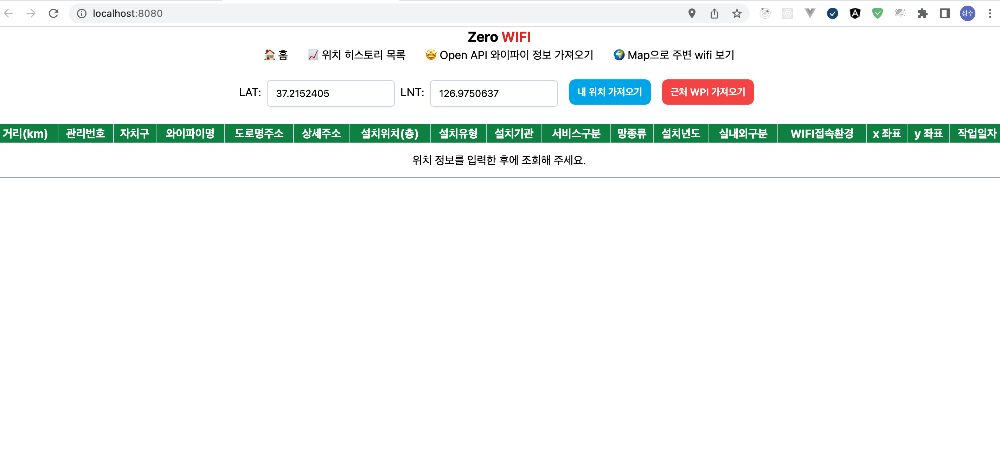
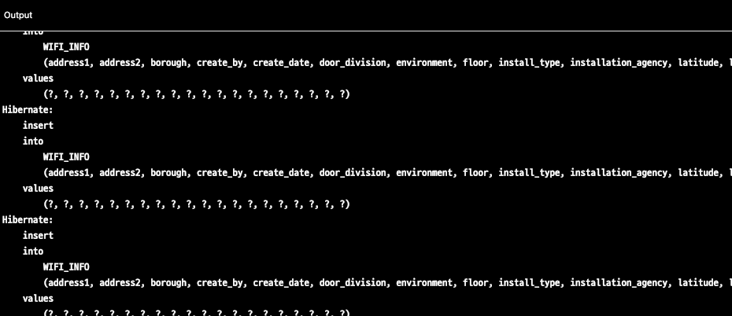
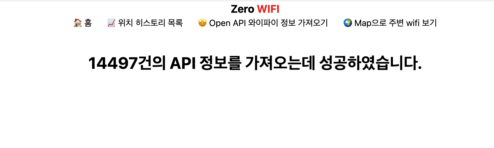
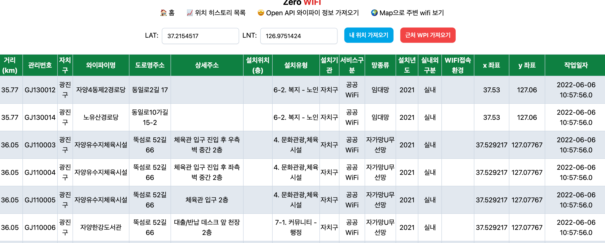
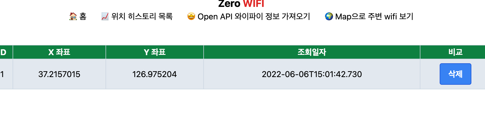
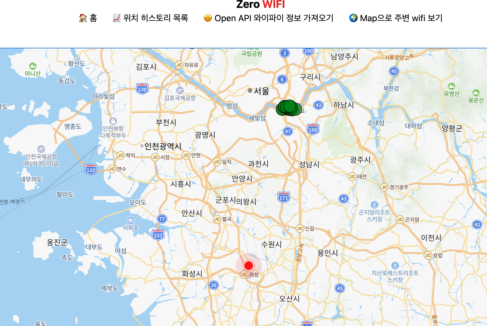
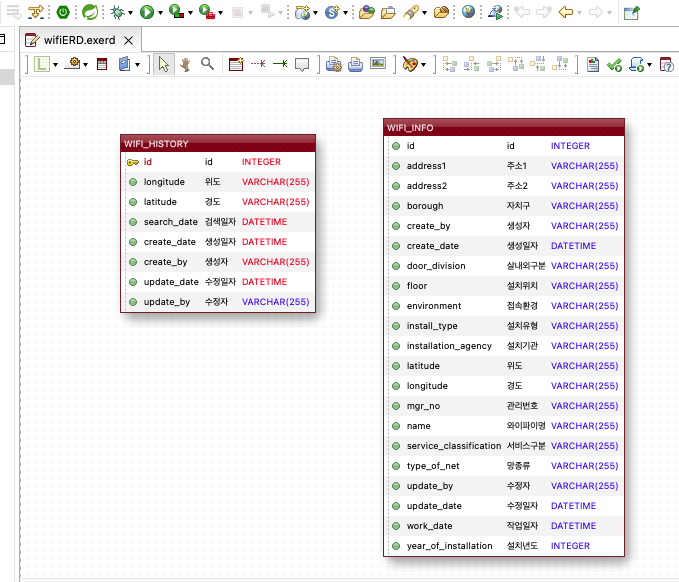
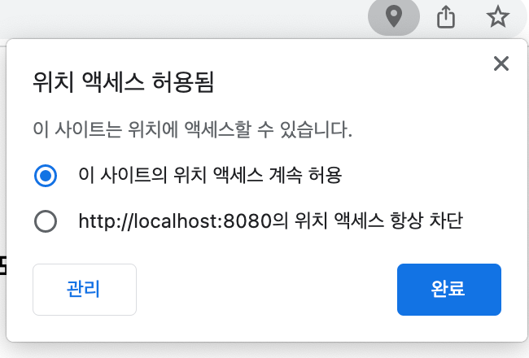
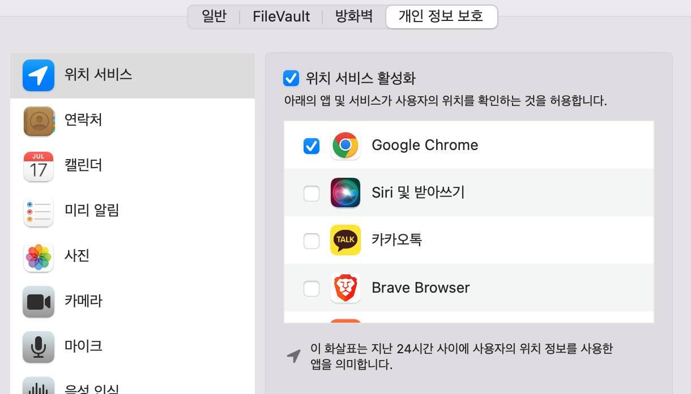

# 프로젝트 설명

- 공공데이터를 이용한 서울시 Wifi 위치 데이터 가져오기

- 사용 라이브러리

<div>
    
    
    
    
    
    
    
</div>

## 메인화면




## 기능

### open API 가져오기

공공데이터를 DB에 저장합니다.
하이버네이트가 작동하는 output 화면 입니다.






### 주변 와이파이 조회

가장 가까운 거리의 20개 와이파이를 조회 합니다.



### history 목록

주변 와이파이 조회 했던 히스토리를 불러옵니다.
물론 삭제기능 까지 추가 하였습니다.




### map으로 주변 목록 보기

네이버 맵을 이용하여 주변의 와이파이를 검색합니다.




## ERD 




# 문제 해결

- tomcat 돌아가지 않는 문제


```shell
chmod a+x /{tomcat 위치}/bin/catalina.sh
```

권한을 부여해줘야 제대로 작동합니다.


- mac에서는 위치 권한을 부여해줘야 한다.





- sqlite 위치 조정

```resources/META-INF/persistence.xml```에서 
```<property name="javax.persistence.jdbc.url" value="jdbc:sqlite:/Users/mac/Desktop/TIL/제로베이스/miniProject/wifi.db" />``` 위치를 사용자 위치로 수정해서 사용해주세요 
